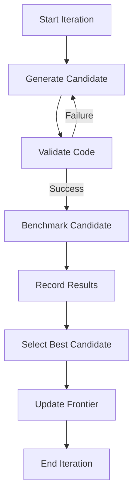

# Meta-Harness Evolution Loop

The Evolution Loop is the core mechanism of the Meta-Harness, designed to iteratively improve agent memory systems and domain skills through autonomous experimentation.

## Architecture

## Subsystems

### 1. Evolution Engine (`src/meta_harness/engine.py`)
The engine manages the state of the evolution process, including the "frontier" (the best-performing system found so far). It constructs the prompts for the "Proposer" (the LLM responsible for generating new harness code).

### 2. Evaluator (`src/meta_harness/evaluator.py`)
A domain-specific protocol that defines how to run benchmarks and calculate scores. Each new domain (e.g., text classification, legal reasoning) must implement this interface.

### 3. Hermes Wrapper (`src/meta_harness/wrapper.py`)
A bridge to the [[Hermes Agent Architecture]], allowing the engine to execute autonomous research sessions and capture tool-use traces.

## Onboarding New Domains
To onboard a new domain, follow the [[Domain Onboarding Standards]]:
1. Define a `domain_spec.md`.
2. Implement an `Evaluator` for the domain.
3. Provide baseline datasets and helper functions.

## Related
- [[Hermes Agent Architecture]]
- [[Domain Onboarding Standards]]
